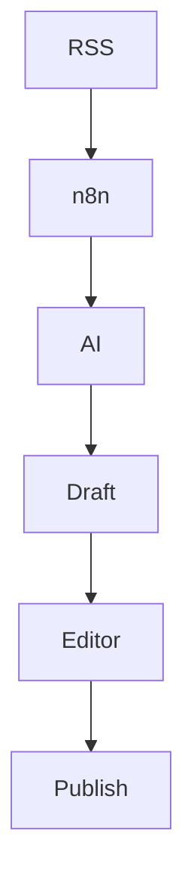

# RichTextEditor v2 — Editor Profissional de Posts

**Projeto:** Vision7 Portal
**Componente:** `src/components/admin/RichTextEditor.tsx`
**Versão:** `2.0.0`
**Status:** ✅ Implementado e testado
**Data de implementação:** 2 de maio de 2026

---

# 1. Visão Geral

O `RichTextEditor v2` transforma o editor de posts do Vision7 num ambiente editorial mais completo, permitindo produzir conteúdos ricos sem depender de HTML manual ou ferramentas externas.

A versão 2 introduz:

* Tabelas estruturadas;
* Tabelas de comparação;
* Blocos de código com syntax highlighting;
* Diagramas e fluxos pré-formatados;
* Menus de ferramentas organizados;
* Formatação avançada;
* Edição inline;
* Estrutura preparada para Mermaid;
* Integração com o fluxo editorial existente;
* Preservação da segurança do conteúdo publicado.

O objetivo não é apenas adicionar ferramentas, mas criar uma base de **editorial authoring** extensível para futuras versões.

---

# 2. Objetivos

## 2.1 Objetivo principal

Permitir que jornalistas, editores e administradores criem artigos visualmente ricos diretamente no painel administrativo.

## 2.2 Objetivos secundários

O editor deve:

* reduzir a necessidade de HTML manual;
* melhorar a leitura durante a edição;
* produzir HTML estruturado;
* preservar semântica do conteúdo;
* facilitar a criação de comparações;
* facilitar documentação técnica;
* suportar conteúdo tecnológico;
* manter compatibilidade com o pipeline de publicação;
* ser seguro contra HTML/JavaScript malicioso;
* funcionar adequadamente em desktop e dispositivos menores;
* permitir expansão futura sem reescrever o editor.

---

# 3. Arquitetura

O editor utiliza o TipTap como camada de edição estruturada.

```text
┌───────────────────────────────────────────────┐
│                 RichTextEditor                │
│                                               │
│  Toolbar · Menus · Shortcuts · Bubble Menu   │
└──────────────────────┬────────────────────────┘
                       │
                       ▼
┌───────────────────────────────────────────────┐
│                    TipTap                     │
│                                               │
│ Document · Paragraph · Heading · Table        │
│ CodeBlock · Image · Link · Lists · etc.      │
└──────────────────────┬────────────────────────┘
                       │
                       ▼
┌───────────────────────────────────────────────┐
│               Editor JSON / HTML              │
└──────────────────────┬────────────────────────┘
                       │
                       ▼
┌───────────────────────────────────────────────┐
│                  PostForm                     │
└──────────────────────┬────────────────────────┘
                       │
                       ▼
┌───────────────────────────────────────────────┐
│                  Supabase                     │
│                                               │
│ PostgreSQL · Storage · Edge Functions         │
└───────────────────────────────────────────────┘
                       │
                       ▼
┌───────────────────────────────────────────────┐
│              Public Article                   │
│                                               │
│ Sanitização → Renderização → DOM              │
└───────────────────────────────────────────────┘
```

---

# 4. Princípios do Editor

O desenvolvimento deve seguir os seguintes princípios:

### 4.1 Semântica primeiro

O editor deve produzir conteúdo semanticamente estruturado, evitando depender de:

* `<div>` desnecessários;
* estilos inline excessivos;
* HTML proprietário;
* conteúdo baseado apenas em aparência visual.

### 4.2 Segurança por padrão

Conteúdo produzido pelo editor deve ser tratado como **untrusted content** quando for renderizado publicamente.

A sanitização deve permanecer ativa no pipeline de publicação.

### 4.3 Extensibilidade

Novas funcionalidades devem ser implementadas como extensões/módulos independentes sempre que possível.

### 4.4 UX editorial

A interface deve priorizar:

* rapidez;
* descoberta das ferramentas;
* atalhos;
* previsibilidade;
* baixa carga cognitiva;
* consistência visual.

---

# 5. Barra de Ferramentas

A toolbar deve ser organizada por grupos funcionais.

## Grupo A — Texto

* Negrito
* Itálico
* Sublinhado
* Tachado
* Código inline
* Limpar formatação

## Grupo B — Estrutura

* Parágrafo
* H1
* H2
* H3
* H4
* Lista ordenada
* Lista não ordenada
* Lista de tarefas
* Blockquote

## Grupo C — Inserção

* Link
* Imagem
* Tabela
* Código
* Diagrama
* Separador

## Grupo D — Histórico

* Undo
* Redo

## Grupo E — Ferramentas avançadas

Dropdown contendo:

* Tabela de comparação
* Diagramas
* Código avançado
* Templates
* Futuramente Mermaid
* Futuramente embeds

---

# 6. Tabelas

O editor suporta criação e edição de tabelas diretamente no conteúdo.

## Templates disponíveis

### 2 × 2

Tabela mínima para pequenas comparações.

### 3 × 3

Tabela padrão para dados estruturados.

### 4 × 5

Tabela para conteúdos mais extensos.

### Tabela de comparação

Template editorial pré-formatado.

Exemplo:

```text
| Recurso | Opção A | Opção B |
|---------|---------|---------|
| Feature 1 | Sim | Não |
| Feature 2 | Não | Sim |
| Preço | €10 | €15 |
```

---

# 7. Recursos de Tabelas

As tabelas devem permitir:

* edição inline;
* adicionar linhas;
* remover linhas;
* adicionar colunas;
* remover colunas;
* dividir células;
* juntar células quando suportado;
* cabeçalho;
* seleção de células;
* navegação por teclado;
* conteúdo multiline;
* responsividade no frontend.

## Regra editorial

Tabelas devem ser utilizadas quando apresentam **relações estruturadas entre dados**.

Não devem ser utilizadas simplesmente para posicionar elementos visualmente.

---

# 8. Diagramas

A versão 2 fornece templates prontos para diagramas editoriais.

## 8.1 Camadas de Arquitetura

Ideal para artigos sobre:

* IA;
* automação;
* sistemas;
* infraestrutura;
* organizações;
* processos digitais.

```text
┌────────────────────────────────────────────┐
│       CAMADA 3 — AGENTES AUTÓNOMOS         │
│ Processos geridos de ponta a ponta por IA  │
└────────────────────────────────────────────┘
                      │
┌────────────────────────────────────────────┐
│      CAMADA 2 — AUTOMAÇÃO ASSISTIDA        │
│ Tarefas repetitivas aceleradas com IA      │
└────────────────────────────────────────────┘
                      │
┌────────────────────────────────────────────┐
│      CAMADA 1 — AUMENTAÇÃO INDIVIDUAL      │
│ Cada colaborador utiliza IA no trabalho    │
└────────────────────────────────────────────┘
```

---

# 9. Arquitetura de Sistema

Template destinado a conteúdos técnicos.

```text
┌──────────────────────────────────────────────┐
│              FRONTEND                        │
│                                              │
│ Homepage · Categorias · Admin · Conteúdo     │
└──────────────────────┬───────────────────────┘
                       │
                       ▼
┌──────────────────────────────────────────────┐
│        DATA / STATE MANAGEMENT               │
│                                              │
│ TanStack Query · Cache · Invalidation        │
└──────────────────────┬───────────────────────┘
                       │
                       ▼
┌──────────────────────────────────────────────┐
│             SUPABASE                         │
│                                              │
│ Auth · PostgREST · Storage · Edge Functions  │
│                 PostgreSQL                   │
└──────────────────────────────────────────────┘
```

---

# 10. Fluxo de Processo

Template sequencial:

```text
┌──────────────┐
│    Entrada   │
└──────┬───────┘
       │
       ▼
┌─────────────────────┐
│   Processamento 1   │
└─────────┬───────────┘
          │
          ▼
┌─────────────────────┐
│   Processamento 2   │
└─────────┬───────────┘
          │
          ▼
┌─────────────────────┐
│     Validação       │
└─────────┬───────────┘
          │
          ▼
┌──────────────┐
│     Saída    │
└──────────────┘
```

---

# 11. Fluxo de Dados

Template destinado a conteúdos de arquitetura e engenharia:

```text
RSS Feed
   │
   ▼
n8n Workflow
   │
   ▼
AI Curation
   │
   ▼
Post Draft
   │
   ▼
Admin Editor
   │
   ▼
TipTap
   │
   ▼
PostForm
   │
   ▼
Supabase
   │
   ▼
TanStack Query Invalidation
   │
   ▼
Public Page
   │
   ▼
Sanitization
   │
   ▼
DOM
```

---

# 12. Blocos de Código

O editor suporta blocos de código com syntax highlighting através do `CodeBlockLowlight`.

Exemplo:

```typescript
const PostForm: React.FC<PostFormProps> = ({ post, onClose }) => {
  const [formData, setFormData] = useState({
    title: post?.title || '',
    content: post?.content || '',
  });

  return (
    <form onSubmit={handleSubmit}>
      {/* Formulário */}
    </form>
  );
};
```

---

# 13. Syntax Highlighting

O sistema deve permitir múltiplas linguagens.

Exemplos:

* JavaScript
* TypeScript
* HTML
* CSS
* JSON
* SQL
* Python
* Bash
* YAML
* Markdown
* outras linguagens suportadas pelo highlighter configurado

A linguagem deve ser armazenada de forma estruturada quando possível.

---

# 14. UX do Código

O bloco de código deve permitir:

* seleção da linguagem;
* edição do conteúdo;
* preservação de whitespace;
* fonte monoespaçada;
* scroll horizontal;
* quebra de linha opcional;
* destaque de sintaxe;
* copy-to-clipboard no frontend publicado.

O código não deve ser executado pelo editor.

---

# 15. Segurança

Esta é uma área obrigatória do RichTextEditor v2.

## 15.1 Conteúdo não confiável

Nunca assumir que HTML produzido pelo editor é automaticamente seguro.

O conteúdo deve passar pelo pipeline de sanitização antes de ser renderizado publicamente.

## 15.2 Sanitização

Manter DOMPurify ou mecanismo equivalente no pipeline de publicação.

Bloquear pelo menos:

```text
<script>
javascript:
onerror=
onclick=
onload=
iframe não autorizado
object
embed
```

e outros elementos/atributos perigosos conforme a política de conteúdo do Vision7.

## 15.3 Links

Links inseridos pelo editor devem ser tratados de forma segura.

Quando aplicável:

```html
rel="noopener noreferrer"
```

## 15.4 Imagens

URLs de imagem devem ser validadas.

Upload deve utilizar o Storage autorizado, evitando permitir que o editor execute upload arbitrário para buckets protegidos.

---

# 16. Acessibilidade

O editor deve seguir boas práticas de acessibilidade.

Garantir:

* navegação por teclado;
* foco visível;
* labels acessíveis;
* `aria-label` nos botões;
* tooltips;
* contraste adequado;
* atalhos de teclado;
* mensagens de erro acessíveis;
* comportamento previsível de dropdowns.

Exemplos de atalhos:

```text
Ctrl/Cmd + B → Negrito
Ctrl/Cmd + I → Itálico
Ctrl/Cmd + Z → Undo
Ctrl/Cmd + Shift + Z → Redo
```

---

# 17. Responsividade

O editor deve funcionar em:

* Desktop
* Laptop
* Tablet
* Mobile

Em telas menores:

* toolbar deve adaptar-se;
* ferramentas secundárias devem migrar para dropdown;
* tabelas devem possuir scroll horizontal;
* blocos de código devem permitir scroll;
* menus não devem ultrapassar o viewport.

---

# 18. Histórico e recuperação

O editor deve utilizar o sistema de histórico do TipTap.

Suportar:

* Undo;
* Redo;
* edição contínua;
* recuperação durante a sessão.

Futuramente:

* autosave;
* draft recovery;
* version history;
* comparação entre versões.

---

# 19. Persistência

O editor deve separar:

### Estado de edição

TipTap JSON.

### Estado de publicação

HTML sanitizado.

Arquitetura recomendada:

```text
TipTap
   │
   ├── JSON → edição / recuperação / futuras migrações
   │
   └── HTML → publicação
                    │
                    ▼
               Sanitização
                    │
                    ▼
               Public Article
```

Quando a arquitetura atual utilizar somente HTML, a introdução do JSON pode ser feita de forma incremental e compatível com conteúdos existentes.

---

# 20. Compatibilidade com conteúdo existente

A implementação não deve quebrar artigos existentes.

É necessário garantir:

* posts antigos continuam renderizando;
* HTML existente continua sendo interpretado;
* conteúdo sem tabelas continua funcionando;
* conteúdo sem código continua funcionando;
* conteúdo sem diagramas continua funcionando;
* migração de formato seja opcional e controlada.

---

# 21. CSS

Os estilos devem permanecer integrados ao sistema visual existente.

Exemplo:

```css
[&_.tiptap_table]:my-4
[&_.tiptap_table]:border-collapse

[&_.tiptap_th]:bg-muted/50
[&_.tiptap_th]:font-semibold

[&_.tiptap_td]:px-3
[&_.tiptap_td]:py-2

[&_.tiptap_pre]:my-4
[&_.tiptap_pre]:rounded-lg
[&_.tiptap_pre]:bg-muted/40
[&_.tiptap_pre]:p-4

[&_.tiptap_code]:font-mono
[&_.tiptap_code]:text-sm
```

Os estilos não devem depender de cores fixas quando o sistema possuir suporte a temas.

---

# 22. Dependências

A implementação utiliza extensões TipTap para:

```json
{
  "@tiptap/extension-table": "^3.20.4",
  "@tiptap/extension-table-row": "^3.20.4",
  "@tiptap/extension-table-header": "^3.20.4",
  "@tiptap/extension-table-cell": "^3.20.4",
  "@tiptap/extension-code-block-lowlight": "^3.20.4",
  "lowlight": "^3.x.x"
}
```

As versões devem permanecer alinhadas entre as extensões TipTap utilizadas.

Antes de upgrades, executar:

```text
npm install
npm run build
npm run lint
npm test
```

quando estes scripts estiverem disponíveis no projeto.

---

# 23. Checklist — v2.0

## Editor

* [x] Tabelas
* [x] Tabelas 2×2
* [x] Tabelas 3×3
* [x] Tabelas 4×5
* [x] Tabela de comparação
* [x] Diagramas
* [x] Arquitetura
* [x] Fluxos
* [x] Fluxo de dados
* [x] Código
* [x] Syntax highlighting
* [x] Dropdowns
* [x] Undo/Redo
* [x] Integração com PostForm

## Segurança

* [x] Sanitização no pipeline
* [x] Conteúdo HTML tratado como não confiável
* [x] Links controlados
* [x] Uploads dependentes das permissões do Storage
* [x] Código não executável

## UX

* [x] Toolbar organizada
* [x] Edição inline
* [x] Atalhos
* [x] Feedback visual
* [x] Responsividade planejada

## Qualidade

* [x] Sem erros de compilação
* [x] Compatibilidade com conteúdo existente
* [x] Integração com TanStack Query
* [x] Integração com Supabase

---

# 24. Testes Obrigatórios

Antes de considerar uma versão estável:

### Tabelas

* criar tabela;
* editar células;
* adicionar linha;
* remover linha;
* adicionar coluna;
* remover coluna;
* guardar;
* recarregar;
* publicar.

### Código

* inserir bloco;
* selecionar linguagem;
* editar;
* guardar;
* recarregar;
* publicar;
* verificar highlight.

### Diagramas

* inserir template;
* editar texto;
* guardar;
* recarregar;
* publicar;
* validar responsividade.

### Segurança

Testar conteúdo contendo:

```html
<script>alert(1)</script>
```

e:

```html

```

O conteúdo malicioso deve ser neutralizado antes da renderização pública.

### Regressão

Testar:

* criação de post;
* edição;
* publicação;
* draft;
* preview;
* autosave quando disponível;
* imagens;
* links;
* categorias;
* tags;
* SEO;
* conteúdo antigo.

---

# 25. Roadmap v2.1+

## Prioridade P0

### Autosave

Salvar automaticamente o draft sem interferir no fluxo manual.

### Recovery

Recuperar conteúdo após:

* refresh;
* fechamento acidental;
* perda de conexão;
* crash do browser.

---

## Prioridade P1

### Mermaid

Adicionar suporte a diagramas declarativos:



A integração deve incluir:

* preview;
* edição;
* sanitização;
* fallback;
* exportação;
* suporte a tema;
* renderização segura.

---

## Prioridade P1

### Templates personalizados

Permitir:

```text
Salvar template
      ↓
Nomear template
      ↓
Guardar
      ↓
Inserir posteriormente
```

Exemplos:

* comparação de produtos;
* arquitetura;
* tutorial;
* checklist;
* timeline;
* processo;
* análise de dados.

---

## Prioridade P2

### Galeria de Diagramas

Biblioteca visual:

```text
Arquitetura
Processo
Fluxograma
Timeline
Ciclo
Hierarquia
Pipeline
Sistema
```

O utilizador escolhe o template e substitui os dados.

---

## Prioridade P2

### Embeds

Suportar de forma controlada:

* YouTube;
* mapas;
* gráficos;
* conteúdos externos autorizados;
* vídeos;
* ferramentas de visualização.

Todo embed deve passar por uma allowlist de domínios.

---

## Prioridade P3

### Colaboração em tempo real

Possível arquitetura:

```text
Editor
   │
   ▼
Collaboration Layer
   │
   ├── Presence
   ├── Cursors
   ├── Awareness
   └── Conflict Resolution
```

Somente implementar quando existir necessidade real de edição simultânea.

---

# 26. Evolução recomendada

O RichTextEditor deve evoluir para uma arquitetura modular:

```text
RichTextEditor
│
├── Toolbar
│   ├── TextTools
│   ├── StructureTools
│   ├── InsertTools
│   └── AdvancedTools
│
├── Extensions
│   ├── Tables
│   ├── Code
│   ├── Images
│   ├── Links
│   ├── Diagrams
│   └── Mermaid
│
├── Templates
│   ├── Comparison
│   ├── Architecture
│   ├── Process
│   └── DataFlow
│
├── Serialization
│   ├── TipTap JSON
│   └── HTML
│
└── Security
    ├── Sanitization
    ├── URL Validation
    ├── Embed Allowlist
    └── Storage Validation
```

Isso evita que `RichTextEditor.tsx` se transforme num componente monolítico à medida que novas funcionalidades sejam adicionadas.

---

# 27. Critérios de sucesso

A versão 2 será considerada estável quando:

* o editor criar conteúdo estruturado;
* tabelas forem editáveis;
* códigos possuírem syntax highlighting;
* diagramas forem inseríveis e editáveis;
* conteúdo existente continuar funcionando;
* publicação não introduzir XSS;
* Storage continuar respeitando permissões;
* toolbar permanecer utilizável;
* editor funcionar em diferentes tamanhos de ecrã;
* build não apresentar erros;
* testes críticos passarem;
* integração com PostForm permanecer funcional.

---

# 28. Estado atual

**RichTextEditor v2.0**

```text
Editor                  ████████████████████ 100%
Tabelas                 ████████████████████ 100%
Código                  ████████████████████ 100%
Diagramas               ████████████████████ 100%
Toolbar                 ████████████████████ 100%
Integração              ████████████████████ 100%
Segurança base          ████████████████████ 100%
Mermaid                 ░░░░░░░░░░░░░░░░░░░░   0%
Templates personalizados░░░░░░░░░░░░░░░░░░░░   0%
Autosave                ░░░░░░░░░░░░░░░░░░░░   0%
Colaboração             ░░░░░░░░░░░░░░░░░░░░   0%
```

**Status:** 🟢 **v2.0 — Estável**

**Próximo marco recomendado:** `RichTextEditor v2.1 — Autosave + Recovery + Mermaid + Template System`
